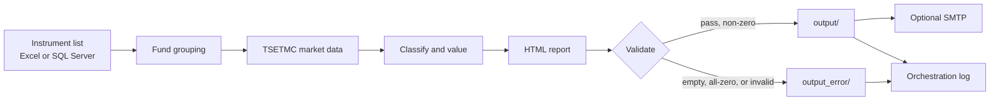

# Automated Intraday Gold Fund Redemption Reporting System


Python pipeline that values gold ETF redemptions during the Tehran cash-market session, validates the result, writes an HTML report, and optionally emails it.

## Overview

Gold ETF cash trading on the Tehran Stock Exchange is concentrated in a defined weekday window. During that window, operations and analytics teams need a consistent view of **institutional (legal-person) activity** against **fund NAV**: which funds are in a redemption regime, which are in issue/redemption, and what that activity is worth.

This repository is a practical **business-analytics + data-automation** workflow. Each run loads the gold-fund instrument universe, pulls live market data, applies documented valuation rules, and produces a timestamped HTML report. Delivery and run history are handled by a generate → validate → send → log orchestrator.

The public copy uses sanitized configuration. Production hosts, mailboxes, and credentials stay in a local `.env` file that is not committed.

## Business Problem

Intraday gold-fund reporting is a **recurring** process: the same universe, the same market fields, and the same classification rules, refreshed as the session moves.

Doing that by hand is easy to get wrong:

- Prices, NAV, and institutional volume come from different TSETMC endpoints and two boards per fund (main vs. market).
- Classification depends on last trade versus redemption NAV; the report then has to show closing price and the **selected** NAV consistently.
- A closed market, a zero-volume session, or a broken HTML file should not be treated as a successful distribution.

The system standardizes that workflow: one command, one HTML artifact per Tehran `YYYY-MM-DD HH:MM` snapshot, with validation before email and a TSV log of generate/email outcomes.

## What the System Does

```text
Instrument list (Excel or SQL Server)
        → Group funds by AssetId (main board + market board)
        → Fetch TSETMC price, NAV, and institutional volume
        → Classify and value each fund
        → Render HTML report
        → Validate the file
        → Optional SMTP delivery
        → Orchestration + application logging
```

| Stage | What happens |
| --- | --- |
| **Data input** | Gold ETF instruments from Excel (`data/طلا.xlsx`) or SQL Server (`src/SQL/FundsList.sql`), selected in `config.yaml`. |
| **Processing** | Funds are paired (price/NAV from the main board; legal volume from the `*2` / market board). TSETMC CDN is queried in parallel. |
| **Validation** | Structural mapping errors, per-fund fetch/calc failures, all-zero values, and empty HTML are handled before any send. |
| **Report generation** | Jinja2 HTML: Redemptions, Subscriptions/Redemptions, optional Error Summary. |
| **Delivery / logging** | Optional SMTP with retries; TSV orchestration log; rotating application log; retention pruning. |

Each run is a **live** snapshot. The job does not backfill historical warehouse dates.

## Key Capabilities

- Instrument extraction from Excel or SQL Server
- Fund grouping by `AssetId` (main board for price/NAV, market board for legal volume)
- Live TSETMC retrieval: last trade, closing price (`pClosing`), ETF NAV, institutional buy volume
- Classification: **Redemption** vs **Issue/Redemption**
- Institutional value = legal buy volume × selected NAV (Rial internally; report shows billion Rial)
- Parallel fund processing (`batch.max_workers`)
- HTML reporting (Jalali display timestamp; Gregorian filename)
- HTML validation before email
- Optional SMTP delivery (RTL Persian body, HTML attachments)
- Retry of the most recent unsent report together with the current file
- Orchestration log (generate / email / non-working-day flags)
- Log and HTML retention windows
- Tehran market-hours context in logs (does not skip the job)

## Architecture



Entry point: `python run.py` → `src/main.py` → `src/orchestration.py` (`run_batch` → validate → send → log).

Detailed module contracts: [`docs/Architecture.md`](docs/Architecture.md). Valuation rules: [`docs/Logic_Documentation.md`](docs/Logic_Documentation.md). Pipeline steps: [`docs/Orchestration.md`](docs/Orchestration.md).

## Technical Stack

| Area | Technologies |
| --- | --- |
| **Language** | Python 3.9+ |
| **Data** | openpyxl (Excel), httpx (TSETMC CDN JSON) |
| **Database** | SQL Server via pyodbc (ODBC Driver 17), query in `src/SQL/FundsList.sql` |
| **Reporting** | Jinja2, HTML (`report/template.html`) |
| **Automation** | CLI orchestrator, smtplib, concurrent.futures |
| **Reliability** | tenacity (HTTP retries), SMTP retries, rotating file logs |
| **Configuration** | YAML (`config.yaml`), environment variables (`.env`) |
| **Time** | `Asia/Tehran` (`zoneinfo` / tzdata), Jalali display via jdatetime |

## Validation & Reliability

Production-minded checks already in the code:

| Mechanism | Behavior |
| --- | --- |
| **HTML validation** | File must exist, be non-empty, and not be an empty `<html></html>` shell. Failures move the file to `output_error/` and skip email. |
| **All-zero guard** | If every calculated value is 0 (or nothing was valued), HTML goes to `output_error/`; generate is logged failed; email is not sent. Typical when the gold cash market is closed or legal volume is 0. |
| **Structural mapping** | Missing main board or missing `TseId` is recorded on the report Error Summary. Funds with no market board are skipped. |
| **Per-fund isolation** | A TSETMC or calculation error on one fund becomes an `ErrorRecord`; other funds still process. |
| **HTTP retries** | Network/timeouts on TSETMC are retried (`api.retry` in `config.yaml`). Missing/invalid JSON fields raise data errors, not silent zeros (except live legal volume, which can be 0). |
| **SMTP retries** | Configurable attempts, delay, and timeout. Generate success + email failure keeps HTML in `output/` for a later send. |
| **Idempotency** | A completed `HH:MM` snapshot is skipped unless `--force`. HTML for that stamp can be reused for an email retry. |
| **Retention** | Orchestration log rows older than `logging.retention_days` (100) and HTML older than `report.retention_days` (10) are pruned each run. |
| **Source contracts** | Excel and SQL loaders require named columns; missing columns fail fast. |

Market hours (Saturday–Wednesday, 12:00–18:00 Tehran) **explain** all-zero runs in the log; they do not skip execution.

## Output

Successful runs write:

`output/intra-day-gold-redemptions-YYYY-MM-DD-HH-MM.html`

| Report section | Content |
| --- | --- |
| Redemptions | Last trade ≤ redemption NAV; value uses redemption NAV |
| Subscriptions/Redemptions | Last trade > redemption NAV; value uses issue NAV |
| Error Summary | Shown only when at least one fund failed |

| Column | Unit | Source rule |
| --- | --- | --- |
| Instrument | — | Main-board name |
| Price | IRR (integer) | First-market closing price (`pClosing`) |
| NAV | IRR (integer) | Selected redemption or issue NAV |
| Institutional volume | units | Live legal-person buy volume |
| Institutional value | billion IRR | Volume × NAV / 1e9 |

A **layout sample** (empty tables, no market figures) is in [`examples/sample-report-layout.html`](examples/sample-report-layout.html). Live reports are written under `output/` (gitignored).

Run history: `logs/orchestration_log.txt` (`ReportName`, `SendDate`, generate/email flags, non-working-day flag). Application detail: `logs/gold_redemptions.log`.

## Project Structure

```text
run.py                       CLI entrypoint
config.yaml                  runtime settings (paths, market hours, email, API)
config.py                    loads YAML and expands ${ENV_VAR}
.env.example                 placeholder secrets (copy to .env)
src/main.py                  argparse, logging, exit codes
src/orchestration.py         generate → validate → send → log
src/pipeline.py              parallel TSETMC batch
src/fund_mapper.py         AssetId → main + market boards
src/excel_reader.py          Excel instrument rows
src/db_reader.py             SQL Server instrument rows
src/tsetmc_client.py         CDN HTTP client
src/calculator.py            classify + institutional value
src/report_generator.py      Jinja2 HTML
src/market_hours.py          Tehran gold cash session
src/SQL/FundsList.sql        gold ETF instrument filter
Send_Email/Email.py          SMTP helper
report/template.html         report layout
data/طلا.xlsx                Excel instrument universe (when db.use_db is false)
examples/                    safe layout sample (no live figures)
docs/                        architecture, logic, orchestration
```

## How to Run

```powershell
python -m venv .venv
.\.venv\Scripts\Activate.ps1
pip install -r requirements.txt
copy .env.example .env
```

Fill `.env` only for the features you use. SQL Server mode needs `DB_SERVER`, `DB_DATABASE`, `DB_USERNAME`, `DB_PASSWORD`, and **ODBC Driver 17 for SQL Server**. Optional `TSETMC_PROXY` if the CDN is blocked. SMTP uses `EMAIL_HOST`, `EMAIL_USER`, `EMAIL_TO`, and optional `EMAIL_CC` when `email.send` is `true` in `config.yaml`.

```powershell
python run.py
python run.py --force --no-send
```

| Flag | Meaning |
| --- | --- |
| `--no-send` | Skip SMTP for this run |
| `--force` | Rebuild HTML even if this `HH:MM` snapshot is already logged complete |

Instrument source: `db.use_db` in `config.yaml` (`false` = Excel, `true` = SQL).

## Limitations / Public Repository Note

This public repository is a **sanitized presentation** of a real reporting workflow:

- SMTP host, mailboxes, database host, and credentials are **not** committed. Use `.env` locally (see `.env.example`).
- Warehouse connection details and production infrastructure are excluded on purpose.
- SQL filters and the Excel universe reflect gold ETF instruments; environment-specific IDs are those of the connected warehouse, not a public data API.
- There is no scheduler in the repository. Scheduling, if used in production, lives outside this codebase.
- TSETMC responses are **live**. A late run is a new snapshot, not a replay of an earlier tape.

Do not commit `.env`, `logs/`, or generated HTML under `output/` / `output_error/`.

## Skills Demonstrated

Python · Data processing · Financial market data · Validation · Reporting automation · SQL / SQL Server integration · HTML / Jinja2 reporting · Business analytics
